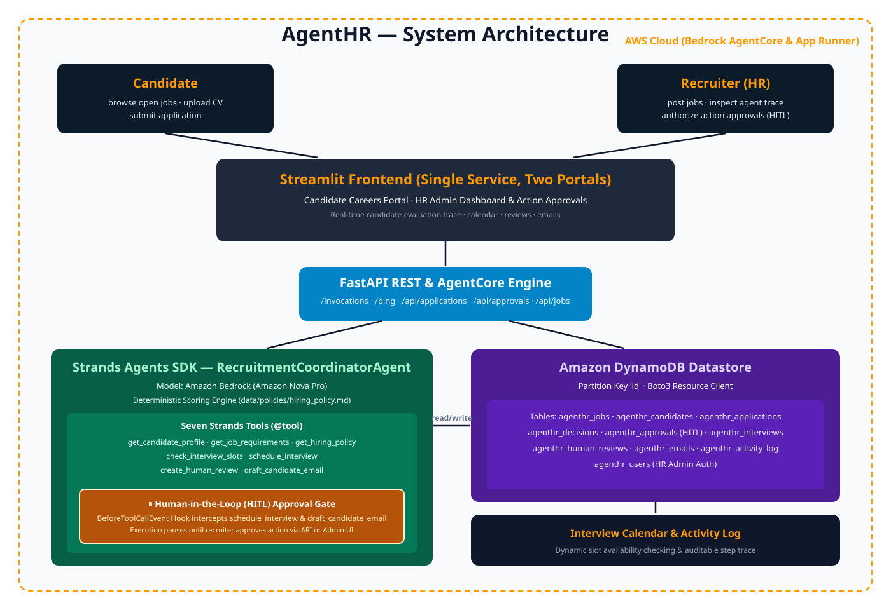

# 🤖 AgentHR — Autonomous Application-to-Action Agent

> **"From application received to recruitment action taken — autonomously with a supervised human checkpoint."**

[](https://strandsagents.com/)
[](https://aws.amazon.com/bedrock/)
[](https://aws.amazon.com/bedrock/)
[](https://aws.amazon.com/dynamodb/)

**🌐 Live Website:** [https://agentichr.sineix.com/](https://agentichr.sineix.com/)
**☁️ AWS Live Deployment:** [http://agenthr-prod.eba-d3tr2asc.us-east-1.elasticbeanstalk.com/](http://agenthr-prod.eba-d3tr2asc.us-east-1.elasticbeanstalk.com/)


---



AgentHR is an autonomous recruiting coordinator agent built for the **AWS "Agents for Humans" Hackathon**. It is not a passive "CV → 85% match" score generator. When a candidate submits an application, a **Strands Agents SDK** agent powered by **Amazon Nova Pro on Amazon Bedrock**:
1. **Understands** the application, extracting candidate profile and qualifications from PDF/DOCX/TXT resumes.
2. **Evaluates** eligibility deterministically against company hiring policy rules (`data/policies/hiring_policy.md`).
3. **Decides** the next appropriate recruitment action (`INTERVIEW`, `HUMAN_REVIEW`, or `REJECT`).
4. **Executes** actions safely through a **Human-in-the-Loop (HITL) Supervised Checkpoint** using Strands' `BeforeToolCallEvent` hook, pausing before sensitive actions (`schedule_interview`, `draft_candidate_email`) until an HR recruiter reviews and approves.
5. **Records** an immutable, auditable activity log of every step, tool invocation, and decision rationale.

```
EVENT         New application received
              ↓
UNDERSTANDING Candidate: Sarah Ali   ·   Job: Senior Backend Engineer
              ↓
EVALUATION    Mandatory: ✓ Python ✓ AWS ✓ REST APIs (Score: 92/100)
              Policy Decision: INTERVIEW
              ↓
STRANDS HOOK  ⚠️ BeforeToolCallEvent INTERCEPTED: schedule_interview & draft_email
              Application status: awaiting_approval
              ↓
HITL GATE     Recruiter clicks [Approve] in Admin Dashboard
              ↓
RESUME ACTION ✓ Calendar slot allocated (conflict-checked)
              ✓ Interview booked on recruiter schedule
              ✓ Personalized invitation email prepared (ready_to_send)
              ↓
AUDIT LOG     Run completed · Auditable rationale persisted to DynamoDB
```

---

## 🏗️ Architecture & Technology Stack

| Layer | Technology | Role |
|---|---|---|
| **Agent Framework** | **Strands Agents SDK** (`strands-agents`) | Autonomous multi-tool coordinator (`strands.Agent`) with `@tool` decorators |
| **Foundation Model** | **Amazon Nova Pro** (`us.amazon.nova-pro-v1:0`) | Reasoning, candidate profile understanding, and personalized email drafting on **Amazon Bedrock** |
| **Supervised Checkpoint** | **Strands `BeforeToolCallEvent` Hook** | Human-in-the-Loop gate pausing outward actions until recruiter approval |
| **State & Datastore** | **Amazon DynamoDB** (or in-memory store) | 10 persistent tables (`applications`, `jobs`, `candidates`, `decisions`, `interviews`, `human_reviews`, `emails`, `activity_log`, `approvals`, `users`) |
| **API & AgentCore** | **FastAPI** + **Bedrock AgentCore Runtime** | Event processing, REST endpoints, plus native `POST /invocations` and `GET /ping` AgentCore contracts |
| **Frontend UI** | **Streamlit** | Dual-portal interface: Public **Candidate Application Portal** & Recruiter **Admin Portal** with live Action Approvals |
| **Deployment** | **AWS App Runner** / **Bedrock AgentCore** | Serverless container deployment with auto-scaling and zero-maintenance runtime |

---

## 🤖 The Strands Agent & The Seven Tools

The agent orchestrates candidate evaluation through 7 specialized tools, decorated with `@tool` from the Strands SDK:

| # | Tool | Function | Checkpoint Behaviour |
|---|---|---|---|
| 1 | `get_candidate_profile()` | Extracts structured candidate details from CV text/file | Read-only |
| 2 | `get_job_requirements()` | Retrieves mandatory and preferred job criteria | Read-only |
| 3 | `get_hiring_policy()` | Loads company decision rules and threshold matrix | Read-only |
| 4 | `check_interview_slots()` | Queries recruiter schedule for conflict-free availability | Read-only |
| 5 | `schedule_interview()` | Books interview slot and reserves calendar event | **Gated by HITL Checkpoint** |
| 6 | `create_human_review()` | Escalates borderline scores (60–84) to policy review | Automated escalation |
| 7 | `draft_candidate_email()` | Prepares personalized candidate communications | **Gated by HITL Checkpoint** |

### Why It Is Genuinely Agentic — Yet Safe
- **Deterministic Policy Compliance**: Match scores are calculated by `app/services/scoring.py` according to `data/policies/hiring_policy.md` (70% mandatory criteria, 30% preferred criteria). The model cannot hallucinate scores or violate hiring policies.
- **Supervised Human-in-the-Loop**: High-stakes external actions (`schedule_interview`, `draft_candidate_email`) are intercepted by the `ApprovalHook` before execution. The recruiter retains final authority via the Action Approvals dashboard.
- **Full Idempotency**: All action tools are keyed by `application_id`. Repeated runs will never double-book calendar slots or duplicate emails.

---

## 🧬 Strands Usage

AgentHR relies on the **Strands Agents SDK** to orchestrate candidate application workflows, tool calling functions, and Human-in-the-Loop lifecycle hooks.

For a comprehensive guide on model setup (Amazon Nova Pro), tool definitions, `BeforeToolCallEvent` hook implementation, and fallback mechanisms, please see [strands_use.md](strands_use.md).

---

## ⚡ Quick Start Guide

### Option 1: Offline Demo Mode (Zero AWS Credentials Required)

AgentHR includes a fully functional, zero-dependency offline mode using an in-memory store and a deterministic mock LLM.

#### 1. Setup Virtual Environment
```bash
python3 -m venv .venv
source .venv/bin/activate   # On Windows: .venv\Scripts\activate
pip install -r requirements.txt
```

#### 2. Run Verification Smoke Test
```bash
python scripts/smoke_test.py
```
*Evaluates 3 sample candidates (strong, borderline, weak), verifies the HITL approval pause, simulates recruiter approval, and asserts end-to-end completion.*

#### 3. Start Backend Server (Terminal 1)
```bash
export STORE_BACKEND=memory
export LLM_BACKEND=mock
export ENABLE_APPROVAL_GATE=true
python3 -m app.main
```
Backend API will be live at `http://localhost:8080`.

#### 4. Start Frontend UI (Terminal 2)
```bash
streamlit run frontend/streamlit_app.py --server.port 8501
```
Open your browser at `http://localhost:8501`.

- **Admin Login Credentials**:
  - **Email**: `hr@agenthr.ai`
  - **Password**: `admin123`

---

### Option 2: Live AWS Mode (Amazon Bedrock & Amazon DynamoDB)

#### 1. Configure AWS Credentials
Ensure your AWS credentials have permissions for Amazon Bedrock (`bedrock:InvokeModel`) and DynamoDB (`dynamodb:*`):
```bash
export AWS_ACCESS_KEY_ID="your-access-key"
export AWS_SECRET_ACCESS_KEY="your-secret-key"
export AWS_REGION="us-east-1"
```

#### 2. Configure Environment Settings
```bash
cp .env.example .env
```
Edit `.env`:
```env
AWS_REGION=us-east-1
BEDROCK_MODEL_ID=us.amazon.nova-pro-v1:0
STORE_BACKEND=dynamodb
DYNAMODB_TABLE_PREFIX=agenthr_
LLM_BACKEND=bedrock
ENABLE_APPROVAL_GATE=true
```

#### 3. Provision DynamoDB Tables
```bash
python scripts/dynamodb_setup.py
```
This provisions all 10 DynamoDB tables with on-demand billing and populates the default admin user and demo job.

#### 4. Launch Application
```bash
# Terminal 1: Backend
python3 -m app.main

# Terminal 2: Streamlit Frontend
streamlit run frontend/streamlit_app.py
```

---

## ☁️ Deployment

### Bedrock AgentCore Runtime

AgentHR natively supports the **Amazon Bedrock AgentCore Runtime** specification:
- Implements `POST /invocations` (standard agent action invocation)
- Implements `GET /ping` (liveness/health probe)
- Configured via `agentcore/agentcore.json` and `agentcore/aws-targets.json`

To test AgentCore endpoints locally:
```bash
python scripts/test_agentcore_endpoints.py
```

To deploy to Amazon Bedrock AgentCore:
```bash
python scripts/deploy_agentcore.py --region us-east-1
```

### AWS App Runner (Container Service)

AgentHR can be deployed directly to AWS App Runner via ECR:
```bash
# Set deployment variables
export AWS_REGION=us-east-1
export ECR_REPO_NAME=agenthr
export APPRUNNER_SERVICE_NAME=agenthr-service

# Run automated build and deploy script
bash scripts/deploy_apprunner.sh
```
The App Runner service will automatically build the container image, publish to ECR, and launch the unified FastAPI + Streamlit service with a public HTTPS URL.

---

##  Testing & Verification Scripts

| Script | Purpose |
|---|---|
| `scripts/smoke_test.py` | Full offline E2E pipeline test with candidate evaluation and HITL approval |
| `scripts/test_approval_gate.py` | Dedicated test suite verifying Approve and Reject workflows |
| `scripts/test_agentcore_endpoints.py` | Validates Bedrock AgentCore `/invocations` and `/ping` endpoints |
| `scripts/dynamodb_setup.py` | Creates and seeds all 10 DynamoDB tables in your AWS account |
| `scripts/dynamodb_e2e.py` | End-to-end live test suite against AWS DynamoDB |

---

## 📁 Repository Structure

```
AgentHR/
├── agentcore/
│   ├── agentcore.json          # Bedrock AgentCore Runtime manifest
│   └── aws-targets.json        # AgentCore action definitions & schemas
├── app/
│   ├── agent/
│   │   ├── agent.py            # Strands Agent coordinator + ApprovalHook
│   │   ├── prompts.py          # Agent system prompts & guidelines
│   │   └── tools.py            # 7 Strands @tool definitions
│   ├── api/
│   │   └── routes.py           # FastAPI routes + AgentCore /invocations & /ping
│   ├── models/
│   │   └── schemas.py          # Pydantic schemas (decisions, approvals, agentcore)
│   ├── services/
│   │   ├── cv_parser.py        # Resume text & metadata extraction
│   │   ├── dynamodb_store.py   # AWS DynamoDB persistent store implementation
│   │   ├── memory_store.py     # In-memory store for offline/testing mode
│   │   ├── store.py            # Store abstraction & factory
│   │   ├── scoring.py          # Deterministic policy compliance scoring engine
│   │   ├── llm.py              # Amazon Bedrock (Nova Pro) & Mock LLM backends
│   │   ├── calendar.py         # Recruiter scheduling & conflict resolution
│   │   └── event_service.py    # Event triggers & database seeding
│   ├── config.py               # Environment configuration settings
│   ├── security.py             # Authentication & session management
│   └── main.py                 # FastAPI application entrypoint
├── data/
│   ├── jobs/backend_engineer.md
│   └── policies/hiring_policy.md
├── frontend/
│   └── streamlit_app.py        # Streamlit UI (Candidate Portal + Recruiter Portal)
├── sample_cvs/                 # Strong, borderline, and weak test CVs
├── scripts/                    # Deployment, setup, and test verification scripts
├── architecture.svg            # Architecture & HITL workflow diagram
├── apprunner.yaml              # AWS App Runner configuration
├── Dockerfile                  # Container definition
├── entrypoint.sh               # Dual-service launcher
├── requirements.txt            # Python dependencies (Strands + AWS boto3)
├── .env.example                # Template environment variables
└── README.md                   # Project documentation
```

---

## ✅ Hackathon Requirements Checklist

| Requirement | Implementation in AgentHR |
|---|---|
| **Strands Agents SDK** | Fully built on `strands-agents` with `strands.Agent`, `@tool` decorators, and event hooks. |
| **AWS Foundation Model** | **Amazon Nova Pro** (`us.amazon.nova-pro-v1:0`) on Amazon Bedrock. |
| **Human-in-the-Loop** | Supervised checkpoint using Strands' `BeforeToolCallEvent` hook intercepting actions before dispatch. |
| **AWS Infrastructure** | **Amazon DynamoDB** for state & audit logs; **AWS App Runner** & **ECR** for hosting. |
| **Bedrock AgentCore** | Native support for Bedrock AgentCore Runtime (`/invocations`, `/ping`, `agentcore.json`). |
| **Deterministic Policy** | Markdown hiring policy + auditable scoring algorithm preventing hallucinations. |
| **Production Ready** | Full test coverage (`smoke_test.py`, `test_approval_gate.py`, `test_agentcore_endpoints.py`). |

---

## 📄 License

This project is licensed under the Apache 2.0 License. See the [LICENSE](LICENSE) file for details.
